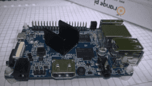

# Orange TorBOX

Этот проект - набор скриптов, который позволит установить и настроить анонимизирующий TOR/I2P MidlleBox быстро и просто.

[Файлы проекта на GitHUB](http://github.com/znoxx/torbox).

[Новости по теме Tor/I2p MiddleBox](http://znoxx.me/tag/torbox/).

## Как это работает ?

После установки ваше *Pi-устройство будет изображать точку доступа WiFi трафик _клиентов_ которой можно будет переключить на работу через TOR, а также использовать устройство для доступа к сети I2P. Устройство управляется через веб-интерфейс и не требует дополнительной настройки. Доступны режимы "всё через TOR", "всё через TOR+Privoxy (встроенный рекламорез)" и "прямое соединение".

Для пользования I2P требуется настроить http-proxy, указывающий на IP адрес устройства.

Установка TOR на оконечные устройства (компьютер, телефон, планшет) не требуется.
 

Текст ниже - перевод руководства по установке и эксплуатации

## Системные требования
Текущая версия поддерживает устройства OrangePI PC и Orange Pi One на базе процессора AllWinner H3, Orange Pi Zero на базе AllWinner H2+, платы Raspberry Pi 1, Raspberry Pi 2, Raspberry Pi 3 и подразумевает следующее:

* Все работает на Debian-подобной ОС (Debian 8+ с работающим system)
* У вас имеется совместимый USB WiFi адаптер (об этом ниже). 
* Интернет подключен через Ethernet и DHCP и интерфейс сконфигурирован, как eth0.

| Плата | Название Hardware Target | Примечания |
|-------|--------------------------|------------|
| Orange Pi PC | orangepipc |
| Orange Pi One | orangepipc |
| Orange Pi Zero | orangepi0 | Поддержан только встроенный WiFi адаптер |
| Raspberry Pi 1 (armv6) | raspberrypi1 | Поддержаны только адаптеры Realtek |
| Raspberry Pi 2 (armv7) | raspberrypi2 | Поддержаны только адаптеры Realtek |
| Raspberry Pi 3 (в режиме armv7) | raspberrypi3 | Поддержаны только собственный адаптер Broadcom, т.е. внешний донгл не требуется. |

## Аппаратные требования
### Подготовка образа
#### Готовый образ
##### Для OrangePi PC и OrangePi One
Базовый образ построен для OrangePI PC (AllWinner H3) на модифицированном ядре от Loboris.

##### Для OrangePi Zero
Базовый образ построен для OrangePI Zero (AllWinner H2+) на дистрибутиве Armbian. По сравнению с оригинальным образом - отключена поддержка 3D за ненадобностью, а также Network Manager для обеспечения ручной настройки WiFi.

##### Для Raspberry Pi 1, Raspberry Pi 2 и Raspberry Pi 3
Базовый образ базируется на проекте [Minibian](https://minibianpi.wordpress.com/), но увеличен до 2 ГБ и добавлен swap.

Требуется карточка как минимиум 2GB.

_Различные производители интерпретируют размер в 2GB по своему. Если вдруг вы увидели ошибку записи с информацией об окончании места - используйте карту либо от другого производителя, либо 4GB карту. Стоят они не дорого._

Готовый образ можно скачать:

##### Для OrangePi PC и OrangePi One
Расположен [здесь](http://znoxx.me/cgi-bin/url.cgi?2jjcGns).

##### Для OrangePi Zero
Расположен [здесь](http://znoxx.me/cgi-bin/url.cgi?2j55knh).

##### Для Raspberry Pi 1-3
Расположен [здесь](http://znoxx.me/cgi-bin/url.cgi?2jjfwJb).

Распакуйте и запишите его на microSD командой dd в Linux, или с помощью Win32DiskImager в Windows.

##### Для OrangePi PC и OrangePi One 

Подмонтируйте первую VFAT партицию (или просто переткните карту в Windows) для того, чтобы установить script.bin, соответствующей вашей плате.

Этот образ изначально настроен для Orange Pi PC. Если вы используете Orange Pi One - эту операцию __нужно__ сделать.

##### Для OrangePi Zero и Raspberry Pi 1-3 
Дополнительных действий с образом не требуется - можно загружать систему.

#### Другие образы
Вы вполне можете использовать свой собственный образ.
Необходимо помнить следующее:

* Интерфейс eth0 должен быть преднастроен и должен использовать DHCP
* Network Manager должен быть отключен или вообще удален. Ну или хотя бы НЕ должен "рулить" вашими WiFi адаптерами.
* Потребуется установить пакеты libnl -  libnl3-200 и  libnl-genl-3-200 для корректной работы hostapd.

Проверьте Вашу карточку - вставьте в устройство, загрузитесь и попробуйте зайти по SSH.

### Поддержанные WiFi адаптеры

Система поддерживает самые доступные и популярные адаптеры

* 0bda:0179 Realtek Semiconductor Corp. RTL8188ETV Wireless LAN 802.11n Network Adapter

* 0bda:8179 Realtek Semiconductor Corp. [RTL8188EUS](http://znoxx.me/cgi-bin/rurl.cgi?1UYTCqW) 802.11n Wireless Network Adapter 
* 148f:7601 Ralink Technology, Corp. MT7601U Wireless Adapter

**НЕ ПОДДЕРЖИВАЕТСЯ В RASPBERRY PI (все версии) И ORANGE PI ZERO**

* Собственный адаптер Raspberry Pi 3
* Собственный адаптер в OrangePi Zero

Вообще, список этот далеко не финальный. Другие адаптеры тоже будут работать, при условии, что для них есть во-первых драйвер, а во-вторых они умеют работать в режиме Access Point с драйверами hostapd   __"nl80211"__ или __"rtl871xdrv"__. Ну или без hostapd, как например поддержанный mt7601.

## Запуск инсталляции
Загрузите ваше устсройство, используя подготовленную SD-карту.

Логин/Пароль для Orange Pi PC, Orange Pi One и Orange Pi Zero - orangepi/orangepi

Логин/Пароль для Raspberry Pi 1-3 - pi/raspberry

Войдите через SSH и дайте следующие команды:

* `sudo apt-get update`
* `sudo apt-get install git`
* `git clone https://github.com/znoxx/torbox.git`

Когда всё скачается, дайте команду:

* `cd torbox`

Теперь отредактируйте __config.inc__ под ваши нужды.

Что менять помимо указания "hardware target" (см. таблицу выше):

* USER - если вы используете учетную запись "orangepi" (в случае ***Orange Pi PC/Orange Pi One***) - просто оставьте её как есть. Для ***Raspberry Pi 1, Raspberry Pi 2 и Raspberry Pi 3*** следует использовать учетную запись "pi". Если свою собственную - замените orangepi на свою запись.
* SSIDNAME - Собственно, ваш будущий WiFi.
* SSIDPASSWORD - пароль к WiFi.
* IPxxx and DHCPxxx- Это настройки сети. Если не нравятся чем-либо предустановленнные, просто отредактируйте их
* WEBUIxxx - настройки WEB UI.Под этим пользователем будет запускаться интерфейс, ну и откуда он будет запускаться.
* I2PUSER - наверное не надо его менять. I2P будет запускаться под вашим пользователем.
* I2PLOCATION - куда будет установлена I2P.
* USESTOCKTOR - какой TOR будем ставить. По умлочанию - тот, что живет в официальных репозитариях Ubuntu/Debian. Если хотите новейшую версию из torproject - установите этот параметр в "0". Правда, возможны проблемы совместимости с systemd.
* HOSTADDR - Этот параметр позволяет обращаться к устройству, используя имя, а не адрес. Он генерируется из параметра "hostname", так, если пример не изменялся - на устройство можно зайти по адресу http://orangepi.torbox:3000. Для этого устройство должно быть в режиме "DIRECT". 

Если редактирование завершено, решительно запускайте инсталлятор.

* `sudo ./installer.sh`

Всё полностью автоматизированно - будут установлены нужные пакеты, а также будет настроен интерфейс __wlan0__.
Инсталлятор работает довольно долго, поскольку качает и Java 8 и node.js из репозитариев.

## Тестирование системы
Как только инсталлятор завершит работу - вставьте ваш USB WiFi в устройство и "передёрните" питание. Если устройство уже имеет встроенный WiFi - просто перезагрузите устройство.
После загрузки  должна быть доступна ваша новая WiFi сеть.
Соединитесь с этой сетью и попробуйте открыть любой URL.

Теперь проверьте в брауезере следующий адрес - http://IPADDRESS:3000 - тот самый адрес, который вы указали в конфигурации или имя хоста - http://yourhost.torbox:3000. WEB-интерфейс должен быть доступен.
Логин/пароль по умлочанию - "orangepi/orangepi". Его можно сменить в самом WebUI.
Переключите режим в TOR или Privoxy и откройте страницу http://check.torproject.org - и если все в порядке, вы увидите сообщение о том, что ваш браузер работает через TOR.

## Режимы работы
Устройство поддерживает 3 режима работы:

* _TOR_ - весь траффик от  __WiFi клиентов__ направляется через TOR
* _PRIVOXY_ - весь траффик от  __WiFi клиентов__ направляется через TOR и PRIVOXY. Вы можете настроить правила для Privoxy, например для вырезания рекламы или кнопок "Like". Лучше свериться с [официальной документацией](http://privoxy.org).
* _DIRECT_ - Весь траффик проходит через точку доступа без TOR/PRIVOXY, но можно задать http/https proxy в браузере, указав IPADDRESS и порт 8118 для анонимизации интернет-траффика.

Эти настройки можно переключать в  WebUI. Помните, что траффик самого устройства не перенаправляется через TOR. Так, например запуска "apt-get" на Pi будет использовать прямое соединение с Интернетом. Итак - через TOR работают только Wifi клиенты.

## Использование I2P
После загрузки можно запустить демона I2P через WebUI. Где-то через пару минту от момента старта можно открыть URL http://IPADDRESS:7657, где, собственно и изменить настройки I2P.
Для доступа к .i2p сайту - установите proxy в системе - в качестве адреса IPADDRESS и порта значение 8118. Где-то через несколько минут вы сможете открывать .i2p сайты.

## Завершение инсталляции
После того, как все настройки проверены, в папке проекта запустите:

* `sudo ./finalize_inst.sh`
* Опционально: `sudo apt-get upgrade`

Это "закроет" firewall и почистит временные файлы.
После этого устройство доступно лишь по адресу IPADDRESS:22 в том случае, если вы соединены с вашей новой точкой доступа.

## Дополнительные сведения о драйверах

Драйвера MediaTek/Ralink НЕ используют hostapd для создания точки доступа. То есть, если вы хотите изменить настройки точки доступа - делать это нужно в соответствующем месте. Для Mediatek - в настройках драйвера. Для остальных - /etc/hostapd/hostapd.conf. Во время инсталляции первичные настройки устанавливаются в обоих локациях.
Таким образом, если ваш USB WiFi -  Mediatek - hostapd просто "тихо" отключится, и точка доступа будет работать через драйвер.
Для других WiFi устройств - используется hostapd.

## Использование других WiFi устройств

Если у вас другой WiFi драйвер, имейте ввиду:

* Убедитесь, что ваше устройство имеет как драйвер, так и firmware, если оно нужно.
* Внестие нужные изменения в  /etc/hostapd/hostapd.conf
* Переименуйте ваш интерфейс беспроводной сети в  wlan0 - это позволит минимизировать изменения.

Я достаточно успешно проверил некоторые устройства TP-Link, так что никаких проблем не ожидается.

##### Для Orange Pi PC и Orange Pi One 
_Имейте ввиду, что инсталлятор перемещает некоторые драйвера от Realtek в /lib/modules-disabled_. Если ваш донгл от Realtek - проверьте нет ли вашего драйвера в этой папке.

## Использование других платформ
В общем случае, в папке "hardware" нужно создать подпапку "myhardware"  (например) и положить в нее специфичные для платформы "артефакты", такие как драйвера, скрипт для мониторинга температуры и скрипт _powersave.sh_, который сгенерирован через powertop.

## Ссылки и благодарности
Спасибо Loboris за работающие и стабильные ядра для OrangepPI http://www.orangepi.org/orangepibbsen/forum.php?mod=viewthread&tid=342

Спасибо bronco за исправление проблем с температурой на  OrangePi http://www.orangepi.org/orangepibbsen/forum.php?mod=viewthread&tid=785

Оригинальный hostapd http://w1.fi/hostapd/  с патчем для Realtek https://github.com/pritambaral/hostapd-rtl871xdrv также используется в системе. Он собран для архитектуры ARM.

[Minibian](https://minibianpi.wordpress.com) с некоторыми изменениями для Raspberry Pi

[Armbian](http://armbian.com) отличная ОС для кучи железа.

Включенные драйвера:

* Realtek 8188eu - https://github.com/lwfinger/rtl8188eu (для Raspberry Pi 1 и Raspberry Pi 2 используется staging драйвер из комплекта ядра)
* Mediatek 7601 AP mode - https://github.com/eywalink/mt7601u (не поддерживается для Raspberry Pi и Orange Pi Zero)

## Отказ от отвественности
Стоит упомянуть:

* Скрипт протестирован и должен работать без проблем. Однако, нет никаких гарантий, что он подойдет под ваши нужды.
* Автор не несет ответственности за любой прямой или косвенный вред от продукта нанесенный как вашему устройству, так и приватности.
* TOR и I2P разработаны для защиты вашей приватности, но не являются панацеей. Использование подразумевает наличие некоторых фундаментальных знаний.